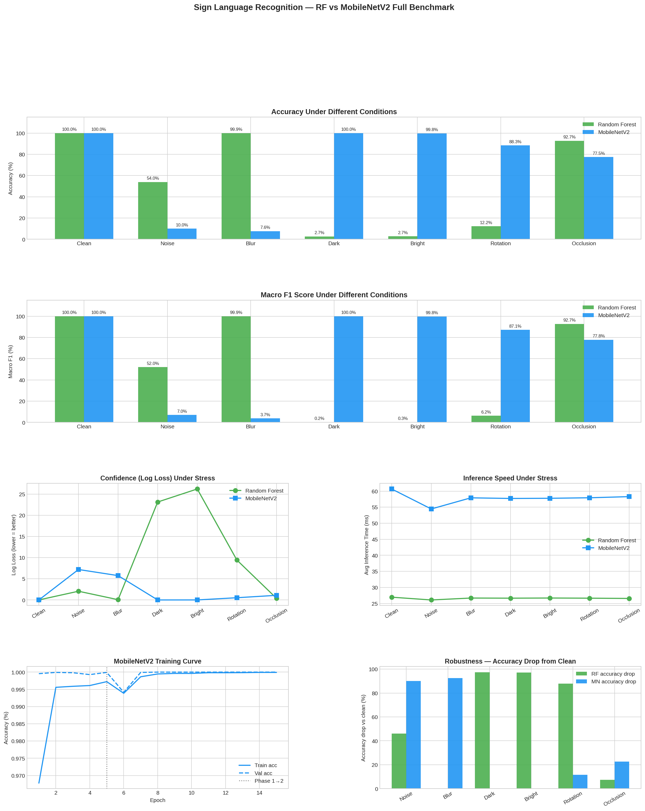
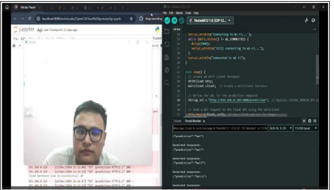
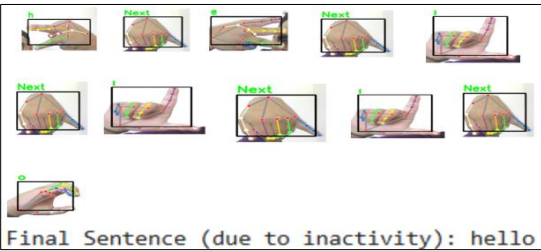

Sign Language Recognition — RF vs MobileNetV2 Benchmark

A comparative study of classical machine learning vs deep transfer learning for real-time sign language recognition, extending the work published in Affordable Real-Time Hand Gesture Detection Using Random Forest (IJISRT, peer-reviewed).


## Setup

### 1 — Clone the repository

```bash
git clone https://github.com/your-username/sign-language-benchmark.git
cd sign-language-benchmark
```

### 2 — Create a virtual environment

```bash
python3 -m venv env
source env/bin/activate        # Linux / Mac
env\Scripts\activate           # Windows
```

### 3 — Install dependencies

```bash
pip install -r requirements.txt
```

### 4 — Verify installation

```bash
python3 -c "import tensorflow, sklearn, cv2, mediapipe; print('All dependencies installed successfully')"
```

> **Note:** The `data/` folder is not included in this repository due to size constraints. Run `step1_grayscale.py` after collecting your dataset to reproduce the preprocessing pipeline.


Overview
This project benchmarks two fundamentally different approaches to sign language recognition on the same dataset — a Random Forest classifier using raw pixel features (the baseline from the published paper) against MobileNetV2 with two-phase transfer learning. Rather than simply reporting accuracy on clean data, the study stress-tests both models under seven real-world degradation conditions to reveal where each approach genuinely wins.

Key Findings
| Condition        | Random Forest | MobileNetV2 | Winner |
|---               |---            |---          |---|
| Clean            | 100.0%        | 100.0%      | Tie |
| Noise            | **54.0%**     | 10.0%       | RF |
| Blur             | **99.9%**     | 7.6%        | RF |
| Dark lighting    | 2.7%          | **100.0%**  | MobileNetV2 |
| Bright lighting  | 2.7%          | **99.8%**   | MobileNetV2 |
| Rotation         | 12.2%         | **88.3%**   | MobileNetV2 |
| Occlusion        | **92.7%**     | 77.5%       | RF |

Random Forest is 2.3× faster (26ms vs 58ms per frame) and more robust to image quality degradation — noise, blur, and partial occlusion. MobileNetV2 completely dominates under lighting and orientation changes, making it the better choice for real-world webcam deployment where lighting conditions vary.


Benchmark Results



The benchmark covers:

Accuracy and F1 score under 7 degradation conditions
Log loss (model confidence) under stress
Inference speed consistency across conditions
MobileNetV2 two-phase training curve
Robustness drop chart — accuracy loss from clean baseline

Dataset

Classes: 37 (ASL alphabet A–Z, digits 0–9, and custom Next gesture)
Images per class: 1,500
Total: 55,500 images
Format: 50×50 grayscale JPEG
Split: 80% train / 20% test (stratified)
Augmentation: Per-batch augmentation during MobileNetV2 training — rotation, shift, zoom, brightness variation


Models
Random Forest (Baseline)

Input: flattened 50×50 grayscale pixel vector (2,500 features), normalised to [0, 1]
Classifier: sklearn.ensemble.RandomForestClassifier, 100 estimators
Model size: 33.2 MB
Avg inference: ~26ms per image

MobileNetV2 (Transfer Learning)

Input: 224×224 RGB (grayscale converted to 3-channel)
Base: MobileNetV2 pretrained on ImageNet, frozen in Phase 1
Head: GlobalAveragePooling → BatchNorm → Dropout(0.5) → Dense(256) → Softmax(37)
Training: Two-phase — head-only (5 epochs) then top-30 layers fine-tuned (10 epochs)
Optimizer: Adam with ReduceLROnPlateau
Model size: 24.8 MB
Avg inference: ~58ms per image
Why This Matters
Raw accuracy on clean data tells you very little about real-world performance. This study shows that model selection for sign language recognition depends heavily on the deployment environment:

Edge devices, controlled environments (good lighting, stable camera) → Random Forest: faster, lighter, sufficient accuracy
Real-world webcam deployment (variable lighting, user movement) → MobileNetV2: handles brightness and rotation changes that completely break pixel-based models

The two-phase transfer learning approach (freeze → fine-tune) allowed MobileNetV2 to converge to 100% validation accuracy within 15 epochs on CPU, demonstrating that effective deep learning does not require GPU infrastructure when starting from strong pretrained weights.

Related Work

Original paper: Affordable Real-Time Hand Gesture Detection Using Random Forest — IJISRT, peer-reviewed, Google Scholar indexed
ESP32 wireless pipeline: The original system used an ESP32 microcontroller as a WSN sensor node transmitting frames to a laptop server for classification, demonstrating edge-to-cloud inference architecture


The glimpse of simple implemantation along.





Author
Abhishek Chauhan** — MSc Computer Science, HAM (Hochschule für angewandtes Management), specialising in Industry 4.0, Robotics and Automation
